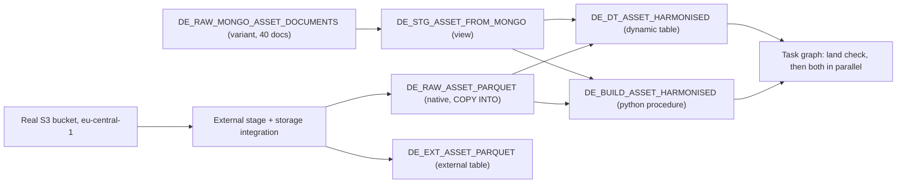

# Data engineering — the part we didn't cover in the technical dive

Romain, with about nine minutes left in the call:

> "Ce dont on n'a pas vraiment parlé, c'est toute la partie ingestion, transformation, l'ETL...
> j'anticipe que ça va être une grosse, grosse, grosse poste."

He's right, and this module is the answer. Everything here is built and verified against a real
Snowflake account and a real S3 bucket — nothing in this README describes something that was
only talked about.

## What was asked, and what answered it

| Romain / JP asked | Elizabeth's answer on the call | What's in this module |
|---|---|---|
| MongoDB is our primary DB, moving off it is the hardest part | OpenFlow (NiFi-based), JDBC/ODBC, "franchement assez simple" | `01_ingest_semistructured_mongo.sql` — lands and flattens Mongo-shaped documents |
| Can you connect to my existing S3 bucket? | Yes — external stage for query-in-place, native tables for ingest, Iceberg for bronze/silver | `02_ingest_parquet_s3.sql` — both paths, against a real bucket |
| What's the SQL transformation story? | "Stream et Tâche et Dynamic Table" | `03_transform_dynamic_tables.sql` |
| Our teams are Python-only, some have no SQL at all | "tout peut être fait en Python pur" | `04_transform_snowpark_procedure.py` — a real deployed procedure, zero SQL strings |
| We use Prefect for orchestration | "vous pouvez garder Prefect, ou vous pourriez éventuellement le remplacer" | `05_orchestration_task_graph.sql` — Tasks, AFTER dependencies, a real DAG |
| dbt Core is integrated? | Yes, natively | Deliberately not built here — see below |

## What's real versus what's cut

Everything numbered 01-05 was executed against a live Snowflake account and produces the row
counts quoted below. Nothing is simulated.

**One deliberate cut: dbt Core.** It's genuinely supported natively in Snowflake, and Elizabeth
mentioned it on the call, but building a working dbt project is a bigger lift than the five
pieces above, and shipping an unverified scaffold isn't better than not shipping it. Worth doing
live in the workshop rather than in this repo.

**One deliberate partial: Iceberg.** `02_ingest_parquet_s3.sql` builds a native table and an
external table over the real bucket — Elizabeth's options 1 and 2 from the call. A full Iceberg
table over an existing bucket needs a second IAM role (an External Volume, not just a Storage
Integration) and Iceberg-format metadata that a plain Parquet file doesn't carry on its own. The
mechanism is identical to what's already here, just pointed at a different resource type — one
more IAM role away, and worth doing live rather than half-building here.

## The pipeline

Two ingestion paths, two transformation paths (one SQL-first via Dynamic Table, one Python-first
via a stored procedure) doing the same reconciliation job side by side, and one orchestration
layer tying it together — so a SQL-comfortable team and a Python-only team can each own a path
against the same governed data, which is exactly the split Deepki has today.

## What was verified, and the numbers to expect

| Object | Verified result |
|---|---|
| `DE_STG_ASSET_FROM_MONGO` | 40 documents, all fields flattened, 0 unexpected NULLs |
| `DE_RAW_ASSET_PARQUET` / `DE_EXT_ASSET_PARQUET` | 60 rows each, native and external table agree exactly: 317,990 m² total |
| `DE_DT_ASSET_HARMONISED` | 40 mongo + 60 parquet rows after a forced refresh, 0 orphan client IDs against `DIM_CLIENT` |
| `DE_BUILD_ASSET_HARMONISED()` | Deployed permanent procedure; `CALL` returns `mongo: 40; parquet_s3: 60`; writes 100 rows |
| Task graph | All three tasks `SUCCEEDED` in `TASK_HISTORY`, correct order (root, then two parallel children), then suspended |

## Running this against your own account

`02_ingest_parquet_s3.sql` is parameterised (`<YOUR_AWS_ACCOUNT_ID>`, `<YOUR_S3_BUCKET>`,
`<YOUR_PREFIX>`) because it was built and verified against a Snowflake demo account's own S3
bucket, not Deepki's. See `DEPLOYMENT.md` for the two-step handshake: create the storage
integration first, read back the IAM user ARN and external ID Snowflake generates, then create
the AWS-side role using those values. The order matters — the AWS role's trust policy cannot be
written correctly until the Snowflake side exists.

Everything else (`01`, `03`, `04`, `05`) runs as-is in any account with `CUSTOM_DEMOS.DEEPKI`
already populated — no bucket, no external credentials, nothing to swap out.

## Object naming

Everything in this module is prefixed `DE_` and lives in the same `CUSTOM_DEMOS.DEEPKI` schema
as the rest of the demo, without modifying anything the Cortex Agent, semantic view, or React app
depend on. Safe to drop entirely (`DROP TABLE/VIEW/DYNAMIC TABLE/PROCEDURE/TASK ... LIKE 'DE_%'`
plus the storage integration and stage) without touching the rest of the demo.
